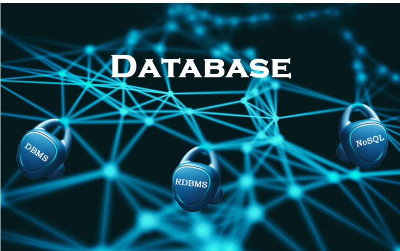
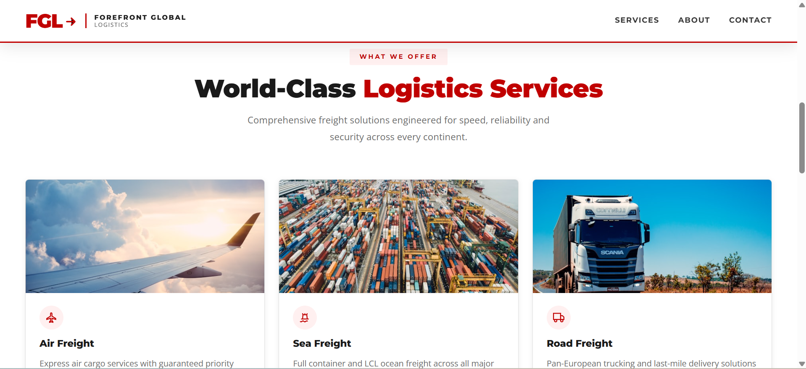
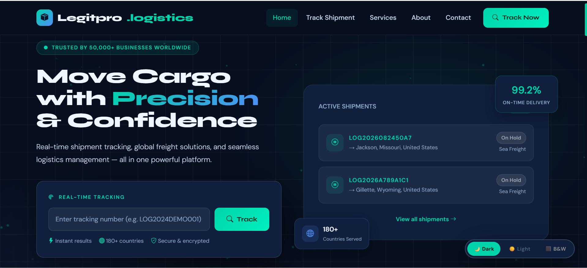
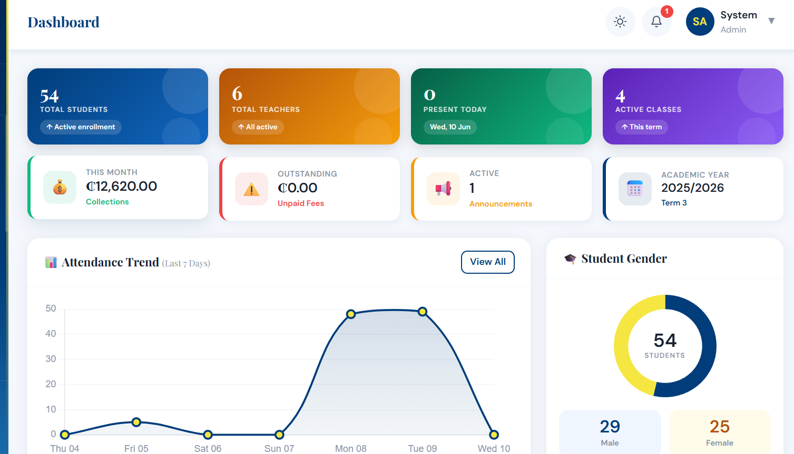
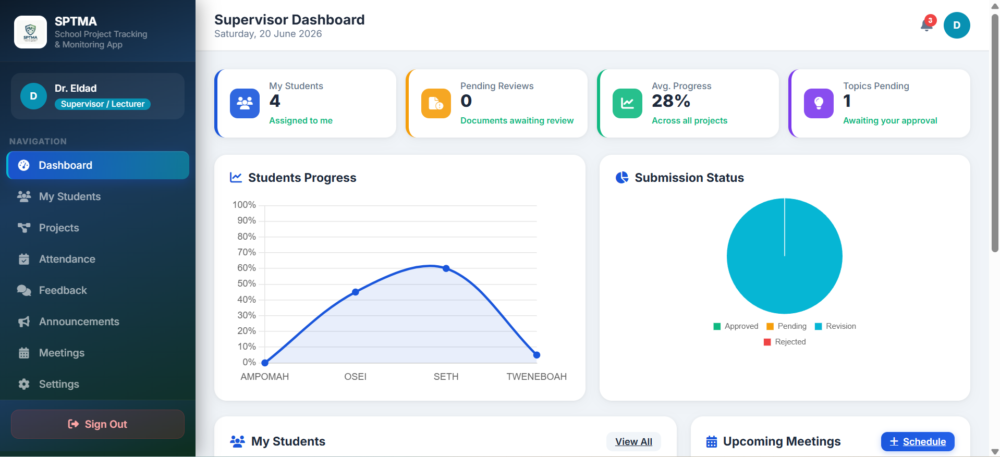
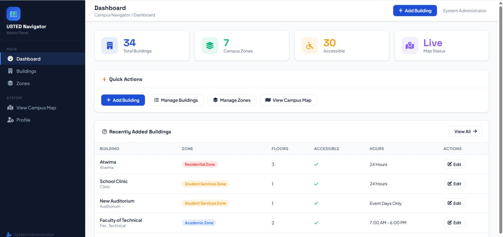
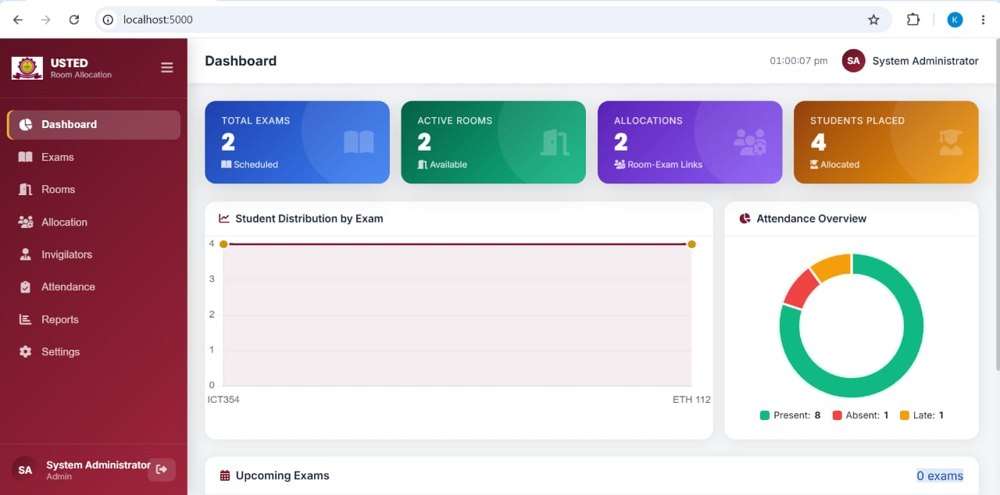

<!DOCTYPE html>
<html lang="en">
<head>
<meta charset="UTF-8">
<meta name="viewport" content="width=device-width,initial-scale=1.0,maximum-scale=1.0">
<title>Osei Morrison — Developer &amp; Designer</title>
<link href="https://fonts.googleapis.com/css2?family=Inter:wght@300;400;500;600;700;800&family=JetBrains+Mono:wght@400;500&display=swap" rel="stylesheet">
<link rel="stylesheet" href="style.css">
</head>
<body>

<nav id="nav">
  <a href="#hero" class="nav-name">OSEI MORRISON</a>
  <ul class="nav-links">
    <li><a href="#hero">Home</a></li>
    <li><a href="#about">About Me</a></li>
    <li><a href="#portfolio">Work</a></li>
    <li><a href="#contact">Contact</a></li>
  </ul>
  

</nav>

  <a href="#hero" onclick="closeMenu()">Home</a>
  <a href="#about" onclick="closeMenu()">About Me</a>
  <a href="#portfolio" onclick="closeMenu()">Work</a>
  <a href="#contact" onclick="closeMenu()">Contact</a>

<!-- HERO -->
<section id="hero">
  

    

      
Hi There!

      <h1 class="hero-name">I'm Osei Morrison</h1>
      
Software Developer &amp; Graphic Designer

      
I build responsive web applications, management systems, and design professional visuals for businesses and institutions across Ghana and beyond.

      

        <a href="https://cal.com/morrison-osei-ymr9rw" target="_blank" class="btn-d btn-cal-hero">
          <svg width="15" height="15" viewBox="0 0 24 24" fill="none" stroke="currentColor" stroke-width="2.5" style="vertical-align:-2px;margin-right:5px"><rect x="3" y="4" width="18" height="18" rx="2"/><line x1="16" y1="2" x2="16" y2="6"/><line x1="8" y1="2" x2="8" y2="6"/><line x1="3" y1="10" x2="21" y2="10"/></svg>Book a Session
        </a>
        <a href="#portfolio" class="btn-o">View My Work</a>
      

      

        PHPNode.jsMySQL
        BootstrapTailwind CSSJavaScript
        C++HTML/CSS
      

    

    

      

      
OSEI MORRISON

    

  

</section>

<!-- WHAT I DO -->
<section id="what">
  

    
<h2 class="stitle">What I Do</h2>

    

      

        

        
<h3>Web Development</h3>
I build fast, responsive websites using PHP, Node.js, Bootstrap and Tailwind CSS — focusing on clean code, performance and mobile-first design.

      

      

        

        
<h3>System Development</h3>
I build complete management systems — school MIS, logistics trackers, e-commerce platforms, campus navigation — ensuring secure and scalable deployment.

      

      

        

        
<h3>Graphic Design</h3>
I design professional brand identities, social media kits, posters, flyers, business cards and marketing materials that make businesses stand out.

      

    

  

</section>

<!-- ABOUT -->
<section id="about">
  

    

    

      Who I Am
      <h2 class="stitle">About Me</h2>

      

        
I'm a Software Developer and IT Graduate based in Kumasi, Ghana &#x1F1EC;&#x1F1ED;, with a passion for crafting clean, impactful software and compelling visual design.

        
Whether building a school management system or designing a brand identity, I deliver with quality and care — available for remote and local projects worldwide.

      

      <ul class="cklist">
        <li>Software Developer &amp; IT Graduate</li>
        <li>PHP &middot; Node.js &middot; MySQL &middot; Bootstrap &middot; Tailwind CSS &middot; C++</li>
        <li>Graphic Designer &mdash; branding, posters, social media kits</li>
        <li>IT Support &amp; hardware maintenance experience</li>
        <li>Available for remote &amp; local projects worldwide</li>
      </ul>
    

  

</section>

<!-- PORTFOLIO -->
<section id="portfolio">
  

    
<h2 class="stitle">Portfolio</h2>

    Web &amp; System Projects
    

      <!-- FGL -->
      

        

<button class="sl-btn prev" onclick="sm('fgl',-1)">&#8249;</button><button class="sl-btn next" onclick="sm('fgl',1)">&#8250;</button>

        
        

          FGL &mdash; Freight &amp; Logistics
          

            <a href="https://fgl.legitrackprologs.info/" target="_blank" class="pbtn pbtn-live">&#127758; Live</a>
            <button class="pbtn pbtn-read" onclick="openModal('fgl')">&#128196; Details</button>
          

        

        
PHPMySQLCSSLogistics

        
&#127758; Public Project

      

      <!-- LEGIT -->
      

        

<button class="sl-btn prev" onclick="sm('legit',-1)">&#8249;</button><button class="sl-btn next" onclick="sm('legit',1)">&#8250;</button>

        
        

          LegitTrack Pro &mdash; Shipment Tracker
          

            <a href="https://legitrackprologs.info/" target="_blank" class="pbtn pbtn-live">&#127758; Live</a>
            <button class="pbtn pbtn-read" onclick="openModal('legit')">&#128196; Details</button>
          

        

        
PHPBootstrapMySQLTracking

        
&#127758; Public Project

      

      <!-- MAMASARK -->
      

        

<button class="sl-btn prev" onclick="sm('mamasark',-1)">&#8249;</button><button class="sl-btn next" onclick="sm('mamasark',1)">&#8250;</button>

        
        

          Mamasark School Complex &mdash; MIS
          

            <a href="https://mamasarkschoolcomplex.com/" target="_blank" class="pbtn pbtn-live">&#127758; Live</a>
            <a href="https://github.com/MORRISON-BEST/MAMAsARK-School-System1" target="_blank" class="pbtn pbtn-code"><svg width="12" height="12" viewBox="0 0 24 24" fill="currentColor" style="vertical-align:-1px"><path d="M12 .297c-6.63 0-12 5.373-12 12 0 5.303 3.438 9.8 8.205 11.385.6.113.82-.258.82-.577 0-.285-.01-1.04-.015-2.04-3.338.724-4.042-1.61-4.042-1.61C4.422 18.07 3.633 17.7 3.633 17.7c-1.087-.744.084-.729.084-.729 1.205.084 1.838 1.236 1.838 1.236 1.07 1.835 2.809 1.305 3.495.998.108-.776.417-1.305.76-1.605-2.665-.3-5.466-1.332-5.466-5.93 0-1.31.465-2.38 1.235-3.22-.135-.303-.54-1.523.105-3.176 0 0 1.005-.322 3.3 1.23.96-.267 1.98-.399 3-.405 1.02.006 2.04.138 3 .405 2.28-1.552 3.285-1.23 3.285-1.23.645 1.653.24 2.873.12 3.176.765.84 1.23 1.91 1.23 3.22 0 4.61-2.805 5.625-5.475 5.92.42.36.81 1.096.81 2.22 0 1.606-.015 2.896-.015 3.286 0 .315.21.69.825.57C20.565 22.092 24 17.592 24 12.297c0-6.627-5.373-12-12-12"/></svg> Code</a>
            <button class="pbtn pbtn-read" onclick="openModal('mamasark')">&#128196; Details</button>
          

        

        
PHPMySQLBootstrapSchool MIS

        
&#127758; Live &amp; Open Source

      

      <!-- SPTMS -->
      

        

<button class="sl-btn prev" onclick="sm('sptms',-1)">&#8249;</button><button class="sl-btn next" onclick="sm('sptms',1)">&#8250;</button>

        
        

          SPTMS &mdash; Student Progress Tracker
          

            <button class="pbtn pbtn-read" onclick="openModal('sptms')">&#128196; Details</button>
          

        

        
PHPMySQLCSS

        
&#128274; Confidential

      

      <!-- CAMPUS -->
      

        

<button class="sl-btn prev" onclick="sm('campus',-1)">&#8249;</button><button class="sl-btn next" onclick="sm('campus',1)">&#8250;</button>

        
        

          Campus Navigation System
          

            <button class="pbtn pbtn-read" onclick="openModal('campus')">&#128196; Details</button>
          

        

        
PHPMySQLMaps

        
&#128274; Confidential

      

      <!-- EXAMS -->
      

        

<button class="sl-btn prev" onclick="sm('exams',-1)">&#8249;</button><button class="sl-btn next" onclick="sm('exams',1)">&#8250;</button>

        
        

          Exams Room Allocation System
          

            <a href="https://github.com/MORRISON-BEST/Usted-exams-room-allocation-system1" target="_blank" class="pbtn pbtn-code"><svg width="12" height="12" viewBox="0 0 24 24" fill="currentColor" style="vertical-align:-1px"><path d="M12 .297c-6.63 0-12 5.373-12 12 0 5.303 3.438 9.8 8.205 11.385.6.113.82-.258.82-.577 0-.285-.01-1.04-.015-2.04-3.338.724-4.042-1.61-4.042-1.61C4.422 18.07 3.633 17.7 3.633 17.7c-1.087-.744.084-.729.084-.729 1.205.084 1.838 1.236 1.838 1.236 1.07 1.835 2.809 1.305 3.495.998.108-.776.417-1.305.76-1.605-2.665-.3-5.466-1.332-5.466-5.93 0-1.31.465-2.38 1.235-3.22-.135-.303-.54-1.523.105-3.176 0 0 1.005-.322 3.3 1.23.96-.267 1.98-.399 3-.405 1.02.006 2.04.138 3 .405 2.28-1.552 3.285-1.23 3.285-1.23.645 1.653.24 2.873.12 3.176.765.84 1.23 1.91 1.23 3.22 0 4.61-2.805 5.625-5.475 5.92.42.36.81 1.096.81 2.22 0 1.606-.015 2.896-.015 3.286 0 .315.21.69.825.57C20.565 22.092 24 17.592 24 12.297c0-6.627-5.373-12-12-12"/></svg> Code</a>
            <button class="pbtn pbtn-read" onclick="openModal('exams')">&#128196; Details</button>
          

        

        
Node.jsMySQLCSS

        
&#128279; Open Source

      

      <!-- SHOPNEST -->
      

        

<button class="sl-btn prev" onclick="sm('shopnest',-1)">&#8249;</button><button class="sl-btn next" onclick="sm('shopnest',1)">&#8250;</button>

        
        

          ShopNest &mdash; Multi-Vendor E-Commerce System
          

            <button class="pbtn pbtn-read" onclick="openModal('shopnest')">&#128196; Details &amp; Case Study</button>
          

        

        
Node.jsMySQLBootstrapPaystackE-CommerceMulti-Vendor

        
&#128274; Confidential Project

      

    

    <!-- GRAPHIC DESIGN -->
    Graphic Design Work
    

      

Morrison Visuals &mdash; Service Flyer
Brand identity &middot; Marketing &middot; Poster design

      

Typography Design
Creative typography &middot; @Morrison

      

Graphics Design Service Poster
Morrison Designs &middot; Kumasi, Ghana

    

    
<a href="#contact" class="btn-d">Get In Touch</a>

  

</section>

<!-- SKILLS -->
<section id="skills">
  

    
<h2 class="stitle">Skills</h2>

    

      

<h3>Web Development</h3>
PHP | HTML | CSS JavaScript | Bootstrap Tailwind CSS | Node.js

      

<h3>System Development</h3>
MySQL | SQL Database Design Query Optimisation

      

<h3>Graphic Design</h3>
Social Media Posters Colour Palettes | Logo Tools: Figma &amp; Canva

      

<h3>Other Skills</h3>
C++ | Algorithms IT Support | Hardware Troubleshooting

    

  

</section>

<!-- CTA -->
<section id="cta" style="padding:70px 5%;">
  

    
Have a project in mind? Let's build something great together.

    
Book a session, send a WhatsApp, or drop me an email — I respond fast.

    

      <a href="https://cal.com/morrison-osei-ymr9rw" target="_blank" class="btn-w btn-cal-cta">
        <svg width="16" height="16" viewBox="0 0 24 24" fill="none" stroke="currentColor" stroke-width="2.5"><rect x="3" y="4" width="18" height="18" rx="2"/><line x1="16" y1="2" x2="16" y2="6"/><line x1="8" y1="2" x2="8" y2="6"/><line x1="3" y1="10" x2="21" y2="10"/></svg>
        Book a Session
      </a>
      <a href="https://wa.me/233598845140" target="_blank" class="btn-w">
        <svg width="16" height="16" viewBox="0 0 24 24" fill="currentColor"><path d="M17.472 14.382c-.297-.149-1.758-.867-2.03-.967-.273-.099-.471-.148-.67.15-.197.297-.767.966-.94 1.164-.173.199-.347.223-.644.075-.297-.15-1.255-.463-2.39-1.475-.883-.788-1.48-1.761-1.653-2.059-.173-.297-.018-.458.13-.606.134-.133.298-.347.446-.52.149-.174.198-.298.298-.497.099-.198.05-.371-.025-.52-.075-.149-.669-1.612-.916-2.207-.242-.579-.487-.5-.669-.51-.173-.008-.371-.01-.57-.01-.198 0-.52.074-.792.372-.272.297-1.04 1.016-1.04 2.479 0 1.462 1.065 2.875 1.213 3.074.149.198 2.096 3.2 5.077 4.487.709.306 1.262.489 1.694.625.712.227 1.36.195 1.871.118.571-.085 1.758-.719 2.006-1.413.248-.694.248-1.289.173-1.413-.074-.124-.272-.198-.57-.347m-5.421 7.403h-.004a9.87 9.87 0 0 1-5.031-1.378l-.361-.214-3.741.982.998-3.648-.235-.374a9.86 9.86 0 0 1-1.51-5.26c.001-5.45 4.436-9.884 9.888-9.884 2.64 0 5.122 1.03 6.988 2.898a9.825 9.825 0 0 1 2.893 6.994c-.003 5.45-4.437 9.884-9.885 9.884m8.413-18.297A11.815 11.815 0 0 0 12.05 0C5.495 0 .16 5.335.157 11.892c0 2.096.547 4.142 1.588 5.945L.057 24l6.305-1.654a11.882 11.882 0 0 0 5.683 1.448h.005c6.554 0 11.89-5.335 11.893-11.893a11.821 11.821 0 0 0-3.48-8.413Z"/></svg>
        WhatsApp
      </a>
      <a href="#portfolio" class="btn-wo">View My Work</a>
    

  

</section>

<!-- FOOTER -->
<footer id="contact">
  

    

      
OSEI MORRISON

      
Software Developer &amp; Graphic Designer

      
&copy; 2026 Osei Morrison. All rights reserved.

    

    

      <a href="mailto:oseimorrison700@gmail.com" class="ft-link"><svg width="18" height="18" viewBox="0 0 24 24" fill="currentColor"><path d="M20 4H4c-1.1 0-1.99.9-1.99 2L2 18c0 1.1.9 2 2 2h16c1.1 0 2-.9 2-2V6c0-1.1-.9-2-2-2zm0 4l-8 5-8-5V6l8 5 8-5v2z"/></svg> oseimorrison700@gmail.com</a>
      <a href="https://wa.me/233599395908" target="_blank" class="ft-link"><svg width="18" height="18" viewBox="0 0 24 24" fill="currentColor"><path d="M17.472 14.382c-.297-.149-1.758-.867-2.03-.967-.273-.099-.471-.148-.67.15-.197.297-.767.966-.94 1.164-.173.199-.347.223-.644.075-.297-.15-1.255-.463-2.39-1.475-.883-.788-1.48-1.761-1.653-2.059-.173-.297-.018-.458.13-.606.134-.133.298-.347.446-.52.149-.174.198-.298.298-.497.099-.198.05-.371-.025-.52-.075-.149-.669-1.612-.916-2.207-.242-.579-.487-.5-.669-.51-.173-.008-.371-.01-.57-.01-.198 0-.52.074-.792.372-.272.297-1.04 1.016-1.04 2.479 0 1.462 1.065 2.875 1.213 3.074.149.198 2.096 3.2 5.077 4.487.709.306 1.262.489 1.694.625.712.227 1.36.195 1.871.118.571-.085 1.758-.719 2.006-1.413.248-.694.248-1.289.173-1.413-.074-.124-.272-.198-.57-.347m-5.421 7.403h-.004a9.87 9.87 0 0 1-5.031-1.378l-.361-.214-3.741.982.998-3.648-.235-.374a9.86 9.86 0 0 1-1.51-5.26c.001-5.45 4.436-9.884 9.888-9.884 2.64 0 5.122 1.03 6.988 2.898a9.825 9.825 0 0 1 2.893 6.994c-.003 5.45-4.437 9.884-9.885 9.884m8.413-18.297A11.815 11.815 0 0 0 12.05 0C5.495 0 .16 5.335.157 11.892c0 2.096.547 4.142 1.588 5.945L.057 24l6.305-1.654a11.882 11.882 0 0 0 5.683 1.448h.005c6.554 0 11.89-5.335 11.893-11.893a11.821 11.821 0 0 0-3.48-8.413Z"/></svg> +233 599 395 908</a>
      <a href="https://github.com/MORRISON-BEST" target="_blank" class="ft-link"><svg width="18" height="18" viewBox="0 0 24 24" fill="currentColor"><path d="M12 .297c-6.63 0-12 5.373-12 12 0 5.303 3.438 9.8 8.205 11.385.6.113.82-.258.82-.577 0-.285-.01-1.04-.015-2.04-3.338.724-4.042-1.61-4.042-1.61C4.422 18.07 3.633 17.7 3.633 17.7c-1.087-.744.084-.729.084-.729 1.205.084 1.838 1.236 1.838 1.236 1.07 1.835 2.809 1.305 3.495.998.108-.776.417-1.305.76-1.605-2.665-.3-5.466-1.332-5.466-5.93 0-1.31.465-2.38 1.235-3.22-.135-.303-.54-1.523.105-3.176 0 0 1.005-.322 3.3 1.23.96-.267 1.98-.399 3-.405 1.02.006 2.04.138 3 .405 2.28-1.552 3.285-1.23 3.285-1.23.645 1.653.24 2.873.12 3.176.765.84 1.23 1.91 1.23 3.22 0 4.61-2.805 5.625-5.475 5.92.42.36.81 1.096.81 2.22 0 1.606-.015 2.896-.015 3.286 0 .315.21.69.825.57C20.565 22.092 24 17.592 24 12.297c0-6.627-5.373-12-12-12"/></svg> github.com/MORRISON-BEST</a>
      <a href="https://www.linkedin.com/in/morrison-osei-97b521354" target="_blank" class="ft-link"><svg width="18" height="18" viewBox="0 0 24 24" fill="currentColor"><path d="M20.447 20.452h-3.554v-5.569c0-1.328-.027-3.037-1.852-3.037-1.853 0-2.136 1.445-2.136 2.939v5.667H9.351V9h3.414v1.561h.046c.477-.9 1.637-1.85 3.37-1.85 3.601 0 4.267 2.37 4.267 5.455v6.286zM5.337 7.433a2.062 2.062 0 0 1-2.063-2.065 2.064 2.064 0 1 1 2.063 2.065zm1.782 13.019H3.555V9h3.564v11.452zM22.225 0H1.771C.792 0 0 .774 0 1.729v20.542C0 23.227.792 24 1.771 24h20.451C23.2 24 24 23.227 24 22.271V1.729C24 .774 23.2 0 22.222 0h.003z"/></svg> linkedin.com/in/morrison-osei</a>
      <a href="https://cal.com/morrison-osei-ymr9rw" target="_blank" class="ft-link ft-cal"><svg width="18" height="18" viewBox="0 0 24 24" fill="none" stroke="currentColor" stroke-width="2"><rect x="3" y="4" width="18" height="18" rx="2"/><line x1="16" y1="2" x2="16" y2="6"/><line x1="8" y1="2" x2="8" y2="6"/><line x1="3" y1="10" x2="21" y2="10"/></svg> Book a Session — cal.com/morrison-osei</a>
    

  

</footer>

<!-- MODALS OVERLAY -->

<!-- FGL MODAL -->

  <button class="modal-close" onclick="closeModal()">&#x2715;</button>
  

    

    

      &#127758; Live Public Site
      <h2 class="modal-title">FGL — Freight &amp; Logistics Platform</h2>
      
PHPMySQLCSSHTML

      
A full-featured freight and shipping management platform built for a logistics company in Ghana. The system handles cargo tracking, client management, shipment processing, and admin reporting — all in one place.

      
<h3>Key Features</h3><ul><li>Real-time cargo tracking dashboard</li><li>Client and shipment management</li><li>Admin reporting &amp; invoice generation</li><li>Mobile-responsive interface</li></ul>

      
<a href="https://fgl.legitrackprologs.info/" target="_blank" class="pbtn pbtn-live">&#127758; View Live Site</a>

    

  

<!-- LEGIT MODAL -->

  <button class="modal-close" onclick="closeModal()">&#x2715;</button>
  

    

    

      &#127758; Live Public Site
      <h2 class="modal-title">LegitTrack Pro — Shipment Tracker</h2>
      
PHPBootstrapMySQLTracking

      
A professional package and shipment tracking system with a customer-facing portal for real-time status updates and an admin dashboard for managing shipments, clients, and delivery records.

      
<h3>Key Features</h3><ul><li>Live shipment tracking with status updates</li><li>Customer self-service tracking portal</li><li>Admin dashboard for shipment management</li><li>Clean Bootstrap-powered responsive UI</li></ul>

      
<a href="https://legitrackprologs.info/" target="_blank" class="pbtn pbtn-live">&#127758; View Live Site</a>

    

  

<!-- MAMASARK MODAL -->

  <button class="modal-close" onclick="closeModal()">&#x2715;</button>
  

    

    

      
&#127758; Live Site&#128279; Open Source

      <h2 class="modal-title">Mamasark School Complex — School MIS</h2>
      
PHPMySQLBootstrapSchool MIS

      
A comprehensive school management information system deployed at Mamasark School Complex. Handles student records, attendance, grading, timetables, and parent communication — all in one digital platform.

      
<h3>Key Features</h3><ul><li>Student enrolment &amp; records management</li><li>Attendance tracking per class and subject</li><li>Grading, results &amp; report card generation</li><li>Timetable builder and staff management</li><li>Parent communication &amp; fee tracking</li></ul>

      

        <h3>&#11088; Case Study — STAR Method</h3>
        
<strong>Situation:</strong> Mamasark School Complex was managing all student records, attendance, and grades on paper and spreadsheets — causing lost data, slow report generation, and major admin overhead every term.

        
<strong>Task:</strong> Design and build a complete school management system that digitises all admin workflows, is easy for non-technical staff to use, and works on any device.

        
<strong>Action:</strong> I built a full-stack MIS using PHP and MySQL with a Bootstrap frontend. I worked closely with the school admin to map their exact workflows, then implemented modules for students, attendance, grading, timetables, and fee management — all behind a secure login system.

        
<strong>Result:</strong> The system is now live and in daily use. Report card generation dropped from 2 days of manual work to under 10 minutes. Staff manage all records digitally with zero data loss since deployment.

      

      

        <a href="https://mamasarkschoolcomplex.com/" target="_blank" class="pbtn pbtn-live">&#127758; Live Site</a>
        <a href="https://github.com/MORRISON-BEST/MAMAsARK-School-System1" target="_blank" class="pbtn pbtn-code"><svg width="12" height="12" viewBox="0 0 24 24" fill="currentColor" style="vertical-align:-1px"><path d="M12 .297c-6.63 0-12 5.373-12 12 0 5.303 3.438 9.8 8.205 11.385.6.113.82-.258.82-.577 0-.285-.01-1.04-.015-2.04-3.338.724-4.042-1.61-4.042-1.61C4.422 18.07 3.633 17.7 3.633 17.7c-1.087-.744.084-.729.084-.729 1.205.084 1.838 1.236 1.838 1.236 1.07 1.835 2.809 1.305 3.495.998.108-.776.417-1.305.76-1.605-2.665-.3-5.466-1.332-5.466-5.93 0-1.31.465-2.38 1.235-3.22-.135-.303-.54-1.523.105-3.176 0 0 1.005-.322 3.3 1.23.96-.267 1.98-.399 3-.405 1.02.006 2.04.138 3 .405 2.28-1.552 3.285-1.23 3.285-1.23.645 1.653.24 2.873.12 3.176.765.84 1.23 1.91 1.23 3.22 0 4.61-2.805 5.625-5.475 5.92.42.36.81 1.096.81 2.22 0 1.606-.015 2.896-.015 3.286 0 .315.21.69.825.57C20.565 22.092 24 17.592 24 12.297c0-6.627-5.373-12-12-12"/></svg> View Code on GitHub</a>
      

    

  

<!-- SPTMS MODAL -->

  <button class="modal-close" onclick="closeModal()">&#x2715;</button>
  

    

    

      &#128274; Confidential Project
      <h2 class="modal-title">SPTMS — Student Progress Tracking &amp; Management System</h2>
      
PHPMySQLCSS

      
A student academic progress tracking system built for an educational institution. Provides educators with real-time dashboards showing individual and class-wide performance, enabling early intervention for struggling students.

      
<h3>Key Features</h3><ul><li>Per-student academic progress dashboards</li><li>Class-level performance analytics</li><li>Teacher grading and comment tools</li><li>Printable progress reports for parents</li></ul>

      

&#128274; Source code and live demo are not publicly available under client confidentiality agreement.

    

  

<!-- CAMPUS MODAL -->

  <button class="modal-close" onclick="closeModal()">&#x2715;</button>
  

    

    

      &#128274; Confidential Project
      <h2 class="modal-title">Campus Navigation &amp; Directory System</h2>
      
PHPMySQLMapsHTML/CSS

      
An interactive campus navigation and directory system for a tertiary institution. Students, staff, and visitors can locate buildings, offices, lecture halls, and facilities with easy search and directional guidance.

      
<h3>Key Features</h3><ul><li>Interactive campus map with clickable locations</li><li>Search by building, room, or department</li><li>Mobile-friendly for on-the-go navigation</li><li>Admin panel to update locations and details</li></ul>

      

&#128274; Source code and live demo are not publicly available under academic project agreement.

    

  

<!-- EXAMS MODAL -->

  <button class="modal-close" onclick="closeModal()">&#x2715;</button>
  

    

    

      &#128279; Open Source on GitHub
      <h2 class="modal-title">Usted Exams Room Allocation System</h2>
      
Node.jsMySQLCSSJavaScript

      
An automated exam room allocation and scheduling system that eliminates manual exam planning. Intelligently assigns students to rooms based on capacity, programme, and timetable constraints.

      
<h3>Key Features</h3><ul><li>Automated room assignment based on capacity</li><li>Conflict detection for overlapping schedules</li><li>Printable seating allocation sheets</li><li>Invigilator assignment and tracking</li><li>Fast async processing with Node.js</li></ul>

      

        <h3>&#11088; Case Study — STAR Method</h3>
        
<strong>Situation:</strong> The institution spent days manually assigning students to exam rooms, often resulting in overcrowding, last-minute changes, and errors that disrupted exam operations.

        
<strong>Task:</strong> Build an automated system that takes student data and exam timetable as input, and outputs a conflict-free room allocation plan within minutes.

        
<strong>Action:</strong> I designed and developed the system in Node.js with MySQL, implementing a constraint-based allocation algorithm that respects room capacities, avoids programme clashes, and handles special requirements. A clean admin dashboard lets staff review and export allocations.

        
<strong>Result:</strong> What took the exams office 3 full days of manual work now runs in under 2 minutes. Zero allocation conflicts recorded on exam days after deployment.

      

      
<a href="https://github.com/MORRISON-BEST/Usted-exams-room-allocation-system1" target="_blank" class="pbtn pbtn-code"><svg width="12" height="12" viewBox="0 0 24 24" fill="currentColor" style="vertical-align:-1px"><path d="M12 .297c-6.63 0-12 5.373-12 12 0 5.303 3.438 9.8 8.205 11.385.6.113.82-.258.82-.577 0-.285-.01-1.04-.015-2.04-3.338.724-4.042-1.61-4.042-1.61C4.422 18.07 3.633 17.7 3.633 17.7c-1.087-.744.084-.729.084-.729 1.205.084 1.838 1.236 1.838 1.236 1.07 1.835 2.809 1.305 3.495.998.108-.776.417-1.305.76-1.605-2.665-.3-5.466-1.332-5.466-5.93 0-1.31.465-2.38 1.235-3.22-.135-.303-.54-1.523.105-3.176 0 0 1.005-.322 3.3 1.23.96-.267 1.98-.399 3-.405 1.02.006 2.04.138 3 .405 2.28-1.552 3.285-1.23 3.285-1.23.645 1.653.24 2.873.12 3.176.765.84 1.23 1.91 1.23 3.22 0 4.61-2.805 5.625-5.475 5.92.42.36.81 1.096.81 2.22 0 1.606-.015 2.896-.015 3.286 0 .315.21.69.825.57C20.565 22.092 24 17.592 24 12.297c0-6.627-5.373-12-12-12"/></svg> View Code on GitHub</a>

    

  

<!-- SHOPNEST MODAL -->

  <button class="modal-close" onclick="closeModal()">&#x2715;</button>
  

    

    

      &#128274; Confidential Project
      <h2 class="modal-title">ShopNest — Multi-Vendor E-Commerce System</h2>
      
Node.jsMySQLBootstrapPaystack

      
A full-featured multi-vendor marketplace platform built for Ghana's local market. Vendors register and manage their own storefronts; customers browse, purchase, and track orders — all secured with Paystack payment integration.

      
<h3>Key Features</h3><ul><li>Multi-vendor storefronts with independent dashboards</li><li>Paystack — Mobile Money, Card &amp; Bank Transfer</li><li>Product listings, categories &amp; featured products</li><li>Customer cart, checkout &amp; order tracking</li><li>Vendor payout and earnings management</li><li>Real-time notifications and messaging</li></ul>

      

        <h3>&#11088; Case Study — STAR Method</h3>
        
<strong>Situation:</strong> Local Ghanaian vendors lacked an affordable, localised platform to sell online. Existing platforms didn't support Mobile Money or cater to the Ghanaian market's specific needs.

        
<strong>Task:</strong> Build a complete multi-vendor e-commerce platform tailored to Ghana — supporting local payments, fast performance, and a simple experience for both vendors and buyers.

        
<strong>Action:</strong> I architected the entire platform in Node.js and MySQL, integrated Paystack for all payment methods, and implemented separate vendor and customer dashboards, product management, order lifecycle tracking, and an admin panel — all with a clean Bootstrap frontend.

        
<strong>Result:</strong> The platform successfully onboarded multiple vendors and processed real transactions. Paystack integration handled payments reliably, validating the system in a real-world commercial environment.

      

      

&#128274; Source code is not publicly available under client confidentiality agreement.

    

  

</body>
</html>
